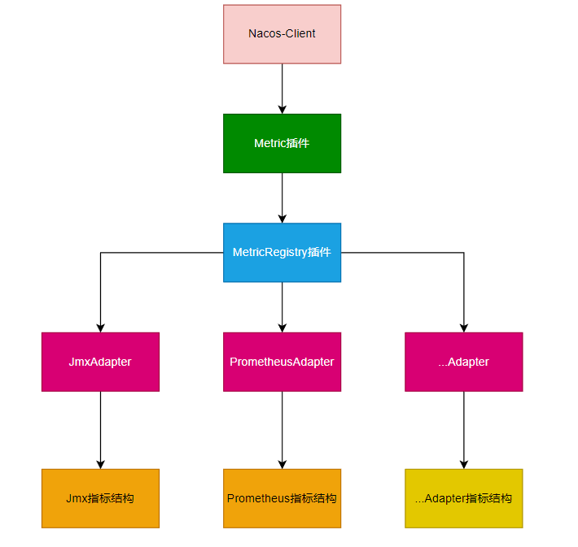

# Nacos-Client移除Prometheus依赖方案

## 引言

### 背景与目的

目前Nacos-Client作为一个SDK应用，它与Prometheus依赖强行绑定。此设计的目的则是为了解除Nacos-Client与Prometheus依赖依赖的强行绑定关系。

### 设计思路

基于Nacos Plugin机制分别定义：
#### Metric Plugin

目前开源领域关于Metrics已有许多实现，例如：
- Micrometer
- Netflix-Spectator
- Dropwizard-Metrics
- Dubbo-Metrics
- ...

它们有的轻而敏捷，有的重而强大。

**参考相关开源实现自定义度量器，用于描述监控数据，度量器类型大致如下所示：**
- Metric：用于标识度量器，以及提供度量器公共的抽象
- Gauge：用于表示一个可变的数值。它通常用于表示系统的当前状态或某个指标的实时值。
- Counter：Counter是一个简单的累加器，用于记录一个事件发生的次数或某个操作执行的次数。
- Histogram：用于度量和统计数据分布的工具。它将一组数据分成不同的桶（buckets），每个桶代表一个数值范围，并记录落入该范围的数据点数量。直方图可以用于测量数据的分布情况，
- Timer：Timer用于测量操作的持续时间。它通常用于记录函数或代码块的执行时间，以便确定性能瓶颈和优化机会。
- ...

对于度量器的具体实现暂未给出更详细的描述，主要参考一些开源的实现。

#### sdk-exposed-metrics-plugin

新增定义Nacos暴漏指标插件，用于定义公共接口，如下：

- MetricRegistry：定义公共的指标注册器，用于注册和获取指标
- MetricsAdapter：定义公共的适配器插件，用于将自定义的Metric转化为第三方监控系统的Metrics。
- MetricRegistryManager
- MetricsAdapterManager

#### 提供对sdk-exposed-metrics-plugin插件的实现：

- 提供对Metric Plugin的实现CompactMetricPlugin
- 提供对Registry Plugin的实现CompactRegistryPlugin
- 提供对MetricsAdapter的实现PrometheusMetricsAdapter，用于将CompactMetrics转化为PrometheusMetrics

#### 如何使用

Nacos-Client默认不引入插件的实现，也就是用户在不使用相关的指标时，不对样本进行存储，如需要使用相关指标数据，例如用户需要获取Nacos-Client的指标数据导出到Prometheus时，用户自行导入相关依赖，通过PrometheusAdapter将数据转为Prometheus的指标结构用于导出。

#### 流程图

Nacos-Client通过Metric将指标记录到MetricRegistry，然后根据对应的Adapter将Metric适配成第三方需要的指标结构，以便用户使用

### 如何扩展

#### 如果需要支持将自定义的Metrics转化为其他第三方的Metrics

自行实现Adapter Plugin

#### 后期如果需要支持其他度量类型

实现Metric接口进行扩展

#### 如果不希望使用SimpleRegistryPlugin

可以完全扩展一个新的Registry库，例如希望使用Netflix Spectator的实现，扩展一个新的插件，然后直接引入即可

