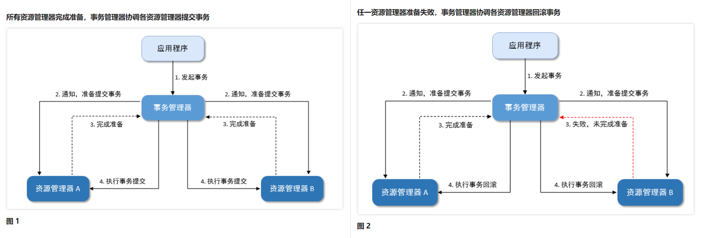

# 分布式事务解决方案

2PC即两阶段提交协议，是分布式事务的核心协议，在此协议中，一个事务管理器协调一个或多个资源管理器的活动，所有资源管理器向事务管理器汇报自身活动状态，事务管理器根据资源管理器的具体状态来决定是否提交事务。

## 流程
- 应用程序向事务管理器提交请求，发起分布式事务
### 第一阶段
- 在第一阶段，事务管理器联络所有资源管理器，通知他们提交本地事务，但是未提交
- 各资源管理器返回本地事务是否执行成功或者失败的状态给事务管理器
### 第二阶段
- 如果所有资源管理器均完成准备，则事务管理器通知各资源管理器执行事务提交
- 如果有一个资源管理器响应失败，则事务管理器通知各资源管理器执行事务回滚

### 流程图

